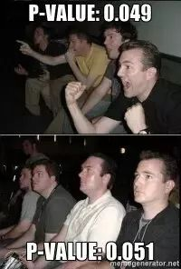
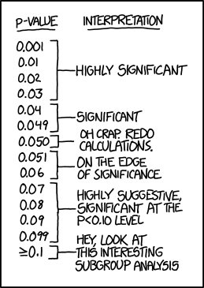

class: middle
# Introduction

- Survival analysis is at the core of epidemiological data analysis. 

- The Cox Proportional Hazard (PH) regression model is (still the most) popular model. 

    -  because of its familiarity and convenience

- Recently, there has been increased interest on applications of survival analysis based on Bayesian methodology.


---
class: middle

# Objectives

- To try and use a parametric Bayesian Survival Model approach and compare with the traditional PH model. 

- The null hypothesis is: the risk of mortality from stroke is the same for people with different milk intake habits.

---
class: middle 

# Data for analysis

- The JACC study data: 

    - 110585 participants (46395 men and 64190 women) aged between 40-79 at baseline
    
---
class: middle

# Exclusion criteria

.med[
1. With stroke history: n = 1496 (915 men and 581 wmen);
2. With cancer history: n = 1461 (411 men and 1050 women);
3. With myocardial infarction history: n = 2994 (1310 men and 1684 women);
4. With ischemic heart diseases history: n = 186 (91 men, 95 women);
5. With other heart diseases history (ICD9 codes: 420-429):  n = 518 (204 men and 314 women);
6. Did not answer the question about milk intake frequency: n = 9545 (3593 men and 5952 women); 
7. Finally, n = 94385 (39386 men and 54999 women) are left in the data
]

---
class: middle

# N of events:

- Total Stroke mortality confirmed: 
  - 2675 (1352 men and 1323 women)
  
- Subtypes of stroke: 
  - Ischemic stroke: <br>957 (520 men and 437 women)
  - Hemorrhagic stroke: <br>952 (432 men and 520 women)

---
class: right
background-image: url("fig/KMfigMen.png")
background-position: 60% 50%
background-size: contain
## Men

---
class: right
background-image: url("fig/KMfigwomen.png")
background-position: 60% 50%
background-size: contain
## Women

---
class: middle, center
# Baseline characteristics 

(please see the handout Table 1 & 2) 

(skipped in the talk)

---
class: middle, 

# Traditional PH model results

(please see the handout Table 3)

.med[
1. Total stroke: <br> only daily drinkers in men had somewhat lower hazard ratio (0.87, 95%CI: 0.76, 1.01)

2. Hemorrhagic stroke: <br> no apparent association for men/women

3. Ischemic stroke: <br> men had milk intake more than 1-2 t/w had **"significantly"** lower hazard compared with non-drinkers
]


---
class: middle, center
# Do the results really answer what we are interested in? 

---
class: middle
## Interpretation of the P value: 

- The earth is round  (p < 0.05).


.pull-left[
```{r p1, echo=FALSE, out.width = '85%', cache=TRUE}

```
]

.pull-right[
```{r p2, echo=FALSE, out.width = '95%', cache=TRUE}

```
]

???
The p-value is the probability of the observed outcome plus all “more extreme” outcomes under the assumption that the experiment can be repeated for infinite times.

---
class: middle, inverse
background-image: url("/fig/CI.gif")
background-position: 50% 50%
background-size: contain

---
class: middle

## Assumptions: 

1. The experiment can be repeated.

2. There is a true value of interest (HR) that does not move.

Both are **unrealistic** for a huge cohort study like the JACC study, and may not help in answering the question that we are really interested in.

---
class: middle

## The real research questions are: 

- What is **the probability** that people who drink milk everyday (or other frequency) had lower hazard of dying from stroke compared with people who don't ?

- If someone does not understand the concept of "hazard", then, the question should be changed into: <br> do people drink milk everyday (or other frequency) have **longer survival time/slower rate of dying** that is free from stroke mortality risk?

---
class: middle

## Bayesian parametric survival model can help us:


- Weibull model is useful because it can be expressed as both
    - accelerated failure time (AFT) model 
    - proportional hazard model

(details skipped, please refer to the handout.)


---
class: middle

### Codes for the crude Weibull survival model

We use the [**BUGS**](https://www.mrc-bsu.cam.ac.uk/software/bugs/) (**B**ayesian inference **U**sing **G**ibbs **S**ampling) language to describe the model:

.small[
```r
jacc.weibull.model <- function() {
  for(i in 1:39386){# loop through the male subjects
*    is.censored[i] ~ dinterval(t[i], c[i])
    t[i] ~ dweib(shape, lambda[i])
    lambda[i] <- exp(-mu[i] * shape)
*    mu[i] <- beta[1] + beta[2] * equals(Mlkfre[i], 2) +
*      beta[3] * equals(Mlkfre[i], 3) + 
*      beta[4] * equals(Mlkfre[i], 4) +
*      beta[5] * equals(Mlkfre[i], 5) 
  }
```
] 
    
---
class: middle

### Specify the priors, and generate values

.small[
```r
  ## priors for betas
  for(j in 1:5){
    beta[j] ~ dnorm(0, 0.001)
  } # increase the number here when adding covariates
  
  ### prior for shape
  shape ~ dgamma(.001, .001)
  
  ### Generated values
*  AFT[2] <- exp(beta[2])
*  HR[2] <- exp(shape * beta[2])
*  p.crit[2] <- step(1 - HR[2]) # = 1 if HR[2] < 1
  
  AFT[3] <- exp(beta[3])
  HR[3] <- exp(shape * beta[3])
  p.crit[3] <- step(1 - HR[3])
  
  AFT[4] <- exp(beta[4])
  HR[4] <- exp(shape * beta[4])
  p.crit[4] <- step(1 - HR[4])
  
  AFT[5] <- exp(beta[5])
  HR[5] <- exp(shape * beta[5])
  p.crit[5] <- step(1 - HR[5])
```
]


---
class: middle

### Run the model (the crude one took me about 1 hours...)

.small[
```r
library(R2jags) #conect to jags sampling engine in R
jagsfit <- jags.parallel(
                   data = JACCdata,
                   parameters.to.save = 
                              c("beta[5]", "HR[5]", "AFT[5]"),
                   #add more variables if you want to check more
*                   n.iter = 10000, 
*                   n.burnin = 2500, 
*                   n.chains = 3,
                   model.file = jacc.weibull.model)
```
]


---
class: middle, center, inverse 

# Output and model checking

---
class: middle

### Direct output:(1)

.small[
```r
# Inference for Bugs model at "jacc.weibull.model", fit using jags,
#  3 chains, each with 10000 iterations (first 2500 discarded), n.thin = 7
#  n.sims = 3213 iterations saved. Sample size per chain = 1071 
# 1. Empirical mean and standard deviation for each variable,
#    plus standard error of the mean:
#                   Mean        SD   Naive SE Time-series SE
# AFT[2]        0.922303  0.064441 0.00113685     0.00420403
# AFT[3]        0.834723  0.051485 0.00090830     0.00362857
# AFT[4]        0.848329  0.052439 0.00092513     0.00401102
# AFT[5]        0.928095  0.041834 0.00073803     0.00336613
# HR[2]         0.890533  0.090586 0.00159811     0.00604246
# HR[3]         0.769913  0.069116 0.00121934     0.00486858
# HR[4]         0.788205  0.070624 0.00124594     0.00531505
*# HR[5]         0.897882  0.058477 0.00103164     0.00468654
*# p.crit[2]     0.871460  0.334743 0.00590548     0.01814848
*# p.crit[3]     0.996265  0.061008 0.00107630     0.00214585
*# p.crit[4]     0.998133  0.043180 0.00076177     0.00097572
*# p.crit[5]     0.953626  0.210327 0.00371056     0.02050164
```
]


---
class: middle

### Direct output (2)


.small[
```r
# 2. Quantiles for each variable:
#                   2.5%          25%          50%         75%       97.5%
# AFT[2]        0.807308     0.876649     0.918049     0.96495     1.05225
# AFT[3]        0.738423     0.799925     0.832078     0.86719     0.94214
# AFT[4]        0.749645     0.810952     0.847050     0.88448     0.95291
# AFT[5]        0.847796     0.899999     0.927850     0.95594     1.01147
# HR[2]         0.733186     0.825541     0.883106     0.94896     1.07725
# HR[3]         0.644053     0.721892     0.765778     0.81289     0.91643
# HR[4]         0.658787     0.737562     0.785538     0.83614     0.93282
# HR[5]         0.788623     0.857453     0.896668     0.93613     1.01665
```
]

---
class: middle, inverse
background-image: url("/fig/traceplot.png")
background-position: 50% 50%
background-size: contain

---
class: middle, inverse
background-image: url("/fig/autocor.png")
background-position: 50% 50%
background-size: contain

---
class: middle

### (Crude) hazard ratios and acceleration factors

```{r tab1, echo=FALSE, eval=TRUE, message=FALSE}
library(knitr)
library(kableExtra)
dt <- read.csv("tab/HRAFTweib.csv", header = T)
names(dt) <- c("Milk intake", "Median", "Mean (SD)", "95% CrI", "MCSE", "Probability", "Median", "Mean (SD)", "95% CrI", "MCSE")
kable(dt, format = "html", caption = "", booktabs = T,linesep = "") %>%
kable_styling(latex_options = c("striped","hold_position"), font_size = 17) %>%
  add_header_above(c(" ", "Hazard ratio (HR)" = 5, "Acceleration factor (AF)" = 4)) %>% 
  footnote(c("Abbreviations: SD, standard deviation; CrI, credible interval; MCSE, Monte Carlo Standard", " Error; Probability indicates that the p for HR smaller than 1."))
```

---
class: middle, inverse
background-image: url("/fig/CrudeHRdist.png")
background-position: 50% 50%
background-size: cover


---
class: middle

### (Age-adjusted) hazard ratios and acceleration factors

```{r tab2, echo=FALSE, eval=TRUE, message=FALSE}

dt <- read.csv("tab/HRAFTweibM1.csv", header = T)
names(dt) <- c("Milk intake", "Median", "Mean (SD)", "95% CrI", "MCSE", "Probability", "Median", "Mean (SD)", "95% CrI", "MCSE")
kable(dt, format = "html", caption = "", booktabs = T,linesep = "") %>%
kable_styling(latex_options = c("striped","hold_position"), font_size = 17) %>%
  add_header_above(c(" ", "Hazard ratio (HR)" = 5, "Acceleration factor (AF)" = 4)) %>% 
  footnote(c("Abbreviations: SD, standard deviation; CrI, credible interval; MCSE, Monte Carlo Standard", " Error; Probability indicates that the p for HR smaller than 1."))
```

---
class: middle, inverse
background-image: url("/fig/AgeHRdist.png")
background-position: 50% 50%
background-size: cover

---
class: middle, center

# Unfortunately, the other results are still calculating.......

The age adjusted model took about 3 hours.

I really need a faster computer..

---
class: middle, center

# The estimated HRs are mostly similar to the results from Cox models.

---
class: middle, center

# And we found a way to answer the real research questions in our mind.


---
class: middle, center

# Thanks and enjoy
